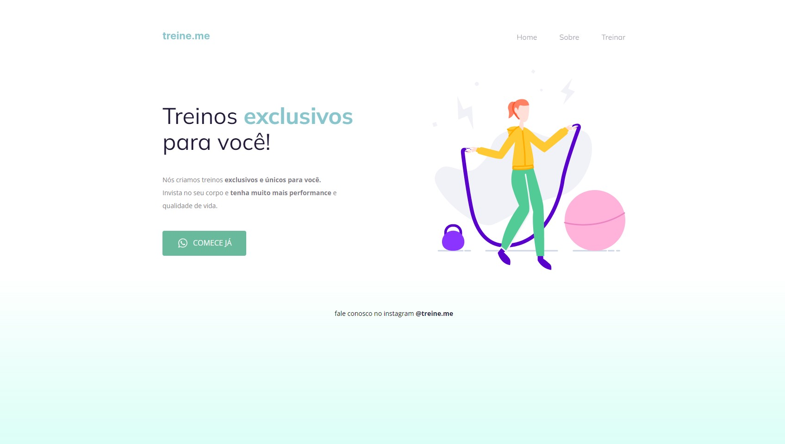

## 💻 Projeto

Está é uma página simples de treinos exclusivos. Neste projeto foi ensinado o conceito do Box-Model e do Flex-box.
 
 

  

 

## 🎯 Deploy
Veja o site publicado [clicando aqui](https://allanfrancis.github.io/Explorer-Projeto-02/).
 
 

## 🚀 Tecnologias
Esse projeto foi desenvolvido com as seguintes tecnologias:
- HTML e CSS
- VS Code
- Git e Github
- Figma
 
 

## 🔖 Layout

Para visualizar o projeto no figma, basta [clicar aqui](https://www.figma.com/file/rkDOHGPwwFtBNqEdHSuQPd/Projeto-02---Explorer?node-id=0%3A1&t=KU7OkNK3dIY0fHNi-0). É necessário ter conta no [Figma](https://figma.com) para acessá-lo.

